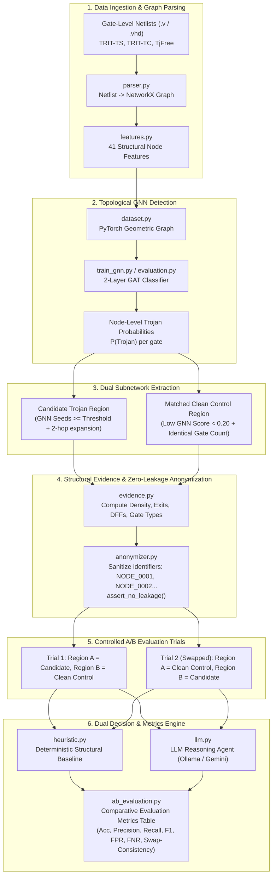

# Hardware Trojan Detection Framework

An end-to-end neuro-symbolic framework for Hardware Trojan detection in gate-level netlists. The framework combines:
1. **Topological Graph Neural Networks (GAT)** for suspicious node localization.
2. **Zero-Leakage Mathematical Anonymization** to eliminate lexical and benchmark name bias.
3. **Controlled A/B Evaluation Engine** to evaluate genuine structural reasoning with counterbalanced swap-invariance testing.
4. **LLM Reasoning & Heuristic Baseline Verification** comparing empirical decisions side-by-side with formal performance metrics (Accuracy, Precision, Recall, F1, FPR, FNR, Specificity, Swap Consistency).

---

## Architecture Diagram



---

## Directory Structure

```
Hardware trojan detection/
├── checkpoints/              # Saved PyTorch GNN weights (trojan_gnn.pt)
├── data/                     # Netlist benchmarks
│   ├── TRIT-TS/              # Trigger-State benchmark netlists
│   ├── TRIT-TC/              # Trigger-Condition benchmark netlists
│   └── TjFree/               # Free open-source IP cores & netlists
├── results/
│   ├── ab_evaluation/        # A/B prompts, JSON results, and comparative summary
│   ├── evidence/             # Raw structural evidence JSONs
│   ├── anonymized/           # Anonymized evidence JSONs
│   └── llm/                  # LLM prompts and reasoning outputs
├── src/
│   ├── ab_evaluation.py      # Controlled A/B evaluation framework & metrics
│   ├── anonymizer.py         # Zero-leakage anonymization with leakage assert checks
│   ├── dataset.py            # Netlist-to-PyG conversion & dataset splitting
│   ├── evaluation.py         # GNN model evaluation & batch testing
│   ├── evidence.py           # Structural netlist feature extraction
│   ├── features.py           # 41 gate-level topological node features
│   ├── gnn.py                # Graph Attention Network (GAT) architecture
│   ├── heuristic.py          # Deterministic structural baseline detector
│   ├── llm.py                # LLM execution client (Ollama / Gemini)
│   ├── llm_prompt.py         # Single-region prompt generator
│   ├── parser.py             # Verilog gate-level netlist parser
│   ├── pipeline.py           # Single-region end-to-end verification pipeline
│   ├── region.py             # Seed extraction and k-hop neighborhood expansion
│   └── train_gnn.py          # GNN training script
└── tests/                    # Unit test suite
```

---

## Installation & Setup

1. **Activate virtual environment**:
   ```bash
   cd "/home/daksh-jain/Code/Minor-Project/Hardware trojan detection"
   source ../.venv/bin/activate
   ```

2. **Install dependencies**:
   ```bash
   pip install -r requirements.txt
   ```

3. **Verify LLM Provider (Optional)**:
   - For **Ollama** (Default): Make sure Ollama is running (`ollama serve`). The default model is `qwen3:4b`.
   - For **Gemini API**: Add your key in `.env`:
     ```env
     GEMINI_API_KEY=your_key_here
     ```
     And set `ACTIVE_PROVIDER = "gemini"` in `src/llm.py`.

---

## Execution Guide & CLI Flags

### 1. Training the GNN (`src/train_gnn.py`)

#### Option A: Train on Specific Files Across Multiple Datasets
```bash
python src/train_gnn.py \
  --files \
    data/TRIT-TS/s13207_T400/s13207_T400.v \
    data/TRIT-TS/s13207_T401/s13207_T401.v \
    data/TRIT-TS/original_designs/s13207scan.v \
    data/TRIT-TC/s1423_T400/s1423_T400.v \
    data/TRIT-TC/original_designs/s1423scan.v \
    data/TjFree/DDR2_Controller-master/design/ddr2_controller.v \
    data/TjFree/DDR2_Controller-master/design/SSTL18DDR2INTERFACE_RTL.v \
    data/TjFree/DDR2_Controller-master/design/process_logic.v \
    data/TRIT-TS/s13207_T421/s13207_T421.v \
    data/TRIT-TC/s1423_T401/s1423_T401.v \
  --split-by file \
  --split-ratio 0.60 0.20 0.20 \
  --epochs 35
```

#### Option B: Train on Canonical Benchmark Family Splits
Splitting by circuit family guarantees that the test family is completely unseen during training:
```bash
python src/train_gnn.py \
  --data-dir data/TRIT-TS \
  --train-families s13207 \
  --val-families s1423 \
  --test-families s35932 \
  --epochs 50 \
  --lr 0.001 \
  --hidden-dim 64 \
  --checkpoint checkpoints/trojan_gnn.pt
```

#### `train_gnn.py` Flags:
| Flag | Type | Description |
|---|---|---|
| `--files` | `str...` | Explicit list of netlist files (`.v`) to train/validate/test on. |
| `--data-dir` | `path...` | Root directory or directories to search for netlist files. |
| `--train-families` | `str...` | Circuit family names assigned to Training set (e.g. `s13207`). |
| `--val-families` | `str...` | Circuit family names assigned to Validation set (e.g. `s1423`). |
| `--test-families` | `str...` | Circuit family names assigned to Test set (e.g. `s35932`). |
| `--split-by` | `{family,file}` | Split strategy (`family` prevents leakage, `file` splits by file count). |
| `--split-ratio` | `float float float` | Train / Val / Test proportions when using `--split-by file` (default: `0.70 0.15 0.15`). |
| `--epochs` | `int` | Number of training epochs (default: `100`). |
| `--lr` | `float` | Adam optimizer learning rate (default: `0.001`). |
| `--hidden-dim` | `int` | Hidden feature dimensionality of GAT layers (default: `64`). |
| `--checkpoint` | `path` | Output path for saving model weights (default: `checkpoints/trojan_gnn.pt`). |
| `--max-samples` | `int` | Optional maximum number of netlists to load for rapid prototyping. |

---

### 2. Controlled A/B Evaluation (`src/ab_evaluation.py`)

The A/B Evaluation framework chains GNN node predictions into candidate extraction, builds matched clean controls, anonymizes both regions, runs Trial 1 & Trial 2 swapped through both the LLM and Heuristic baseline, and outputs full comparative metrics.

#### Option A: Evaluate on Specific Files
```bash
python src/ab_evaluation.py \
  --files \
    data/TRIT-TS/s35932_T428/s35932_T428.v \
    data/TRIT-TS/s35932_T431/s35932_T431.v \
    data/TRIT-TS/s13207_T421/s13207_T421.v \
    data/TRIT-TS/original_designs/s13207scan.v \
  --checkpoint checkpoints/trojan_gnn.pt
```

#### Option B: Evaluate on a Single Circuit with Detailed Explanation
```bash
python src/ab_evaluation.py \
  --circuit data/TRIT-TS/s13207_T421/s13207_T421.v \
  --checkpoint checkpoints/trojan_gnn.pt
```

#### Option C: Fast Baseline Heuristic Evaluation (Skip LLM Inference)
```bash
python src/ab_evaluation.py \
  --data-dir data/TRIT-TS \
  --max-circuits 20 \
  --skip-llm
```

#### `ab_evaluation.py` Flags:
| Flag | Type | Description |
|---|---|---|
| `--circuit` | `path` | Path to a single netlist file (`.v`) to evaluate. |
| `--files` | `path...` | Multiple specific netlist paths to evaluate as a cohort. |
| `--data-dir` | `path` | Directory containing netlists to batch evaluate. |
| `--checkpoint` | `path` | Path to trained GNN model checkpoint (default: `checkpoints/trojan_gnn.pt`). |
| `--gnn-threshold` | `float` | GNN probability threshold for selecting suspicious seed gates (default: `0.95`). |
| `--hops` | `int` | Neighborhood expansion radius around seed gates (default: `2`). |
| `--output-dir` | `path` | Directory where JSON results and prompts are saved (default: `results/ab_evaluation`). |
| `--max-circuits` | `int` | Maximum number of circuits to evaluate in batch mode. |
| `--skip-llm` | `flag` | Skip LLM inference and only compute heuristic baseline metrics. |

---

### 3. Single-Region Pipeline (`src/pipeline.py`)

If you want to run the GNN, extract only the single suspicious Trojan region, and have the LLM produce a standalone hardware security assessment report (identifying trigger counters, state registers, and payload gates):

```bash
python src/pipeline.py \
  --circuit data/TRIT-TS/s13207_T421/s13207_T421.v \
  --checkpoint checkpoints/trojan_gnn.pt
```

Results are saved to:
- Evidence: `results/evidence/s13207_T421_evidence.json`
- Anonymized: `results/anonymized/s13207_T421_evidence_anonymized.json`
- Prompt: `results/llm/s13207_T421_evidence_anonymized_prompt.txt`
- LLM Output: `results/llm/s13207_T421_evidence_anonymized_llm.json`

---

## Evaluation Metrics Output

Running `ab_evaluation.py` prints a comparative table and saves `results/ab_evaluation/ab_metrics_summary.json`:

```
====================================================================================================
COMPARATIVE A/B EVALUATION SUMMARY: HEURISTIC BASELINE vs. LLM AGENT
====================================================================================================
Metric                          Heuristic Baseline           LLM Reasoning Agent
----------------------------------------------------------------------------------------------------
Total Circuits Evaluated        4                            4
Trojan Circuits Evaluated       3                            3
Clean Circuits Evaluated        1                            1
Overall Accuracy                100.00%                      75.00%
Precision                       100.00%                      75.00%
Recall (True Positive Rate)     100.00%                      100.00%
Specificity (True Negative Rate)100.00%                      0.00%
F1-Score                        100.00%                      85.71%
False Positive Rate (FPR)       0.00%                        100.00%
False Negative Rate (FNR)       0.00%                        0.00%
Swap-Consistent Decisions       100.00% (4/4)                75.00% (3/4)
Position Bias Detected          0.00% (0/4)                  25.00% (1/4)
----------------------------------------------------------------------------------------------------
Confusion Matrix:
  TP / FP / TN / FN             3 / 0 / 1 / 0                3 / 1 / 0 / 0
====================================================================================================
```

---

## Running Unit Tests

Run the test suite to ensure all parsers, anonymizers, feature extractors, and leakage assertions pass:

```bash
python -m unittest discover tests
```
