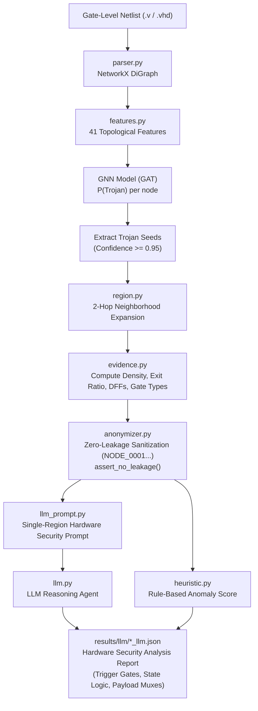
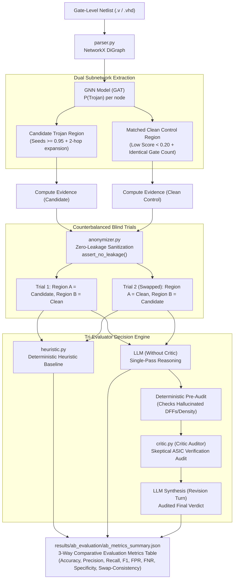

# Hardware Trojan Detection Framework

An end-to-end neuro-symbolic framework for Hardware Trojan detection in gate-level netlists. The framework combines:
1. **Topological Graph Neural Networks (GAT)** for suspicious node localization.
2. **Zero-Leakage Mathematical Anonymization** to eliminate lexical and benchmark name bias.
3. **Controlled A/B Evaluation Engine** to evaluate genuine structural reasoning with counterbalanced swap-invariance testing.
4. **LLM Reasoning & Heuristic Baseline Verification** comparing empirical decisions side-by-side with formal performance metrics (Accuracy, Precision, Recall, F1, FPR, FNR, Specificity, Swap Consistency).

---

## System Architectures & Flowcharts

The framework provides two distinct operational flows:
1. **Flow 1: Single-Region Verification Pipeline (`src/pipeline.py`)** for deep root-cause explanation of a single suspect region.
2. **Flow 2: Controlled A/B Evaluation Framework (`src/ab_evaluation.py`)** with Actor-Critic reflection for unbiased benchmark evaluation.

### Flowchart 1: Single-Region Verification Pipeline (`src/pipeline.py`)


---

### Flowchart 2: Controlled A/B Evaluation with Actor-Critic Loop (`src/ab_evaluation.py`)


---

## Directory Structure

```
Hardware trojan detection/
├── checkpoints/              # Saved PyTorch GNN weights (trojan_gnn.pt)
├── data/                     # Netlist benchmarks
│   ├── TRIT-TS/              # Trigger-State benchmark netlists
│   ├── TRIT-TC/              # Trigger-Condition benchmark netlists
│   └── TjFree/               # Free open-source IP cores & netlists
├── results/
│   ├── ab_evaluation/        # A/B prompts, JSON results, and comparative summary
│   ├── evidence/             # Raw structural evidence JSONs
│   ├── anonymized/           # Anonymized evidence JSONs
│   └── llm/                  # LLM prompts and reasoning outputs
├── src/
│   ├── ab_evaluation.py      # Controlled A/B evaluation framework & metrics
│   ├── anonymizer.py         # Zero-leakage anonymization with leakage assert checks
│   ├── dataset.py            # Netlist-to-PyG conversion & dataset splitting
│   ├── evaluation.py         # GNN model evaluation & batch testing
│   ├── evidence.py           # Structural netlist feature extraction
│   ├── features.py           # 41 gate-level topological node features
│   ├── gnn.py                # Graph Attention Network (GAT) architecture
│   ├── heuristic.py          # Deterministic structural baseline detector
│   ├── llm.py                # LLM execution client (Ollama / Gemini)
│   ├── llm_prompt.py         # Single-region prompt generator
│   ├── parser.py             # Verilog gate-level netlist parser
│   ├── pipeline.py           # Single-region end-to-end verification pipeline
│   ├── region.py             # Seed extraction and k-hop neighborhood expansion
│   └── train_gnn.py          # GNN training script
└── tests/                    # Unit test suite
```

---

## Installation & Setup

1. **Activate virtual environment**:
   ```bash
   cd "/home/daksh-jain/Code/Minor-Project/Hardware trojan detection"
   source ../.venv/bin/activate
   ```

2. **Install dependencies**:
   ```bash
   pip install -r requirements.txt
   ```

3. **Verify LLM Provider (Optional)**:
   - For **Ollama** (Default): Make sure Ollama is running (`ollama serve`). The default model is `qwen3:4b`.
   - For **Gemini API**: Add your key in `.env`:
     ```env
     GEMINI_API_KEY=your_key_here
     ```
     And set `ACTIVE_PROVIDER = "gemini"` in `src/llm.py`.

---

## Execution Guide & CLI Flags

### 1. Training the GNN (`src/train_gnn.py`)

#### Option A: Train on Specific Files Across Multiple Datasets
```bash
python src/train_gnn.py \
  --files \
    data/TRIT-TS/s13207_T400/s13207_T400.v \
    data/TRIT-TS/s13207_T401/s13207_T401.v \
    data/TRIT-TS/original_designs/s13207scan.v \
    data/TRIT-TC/s1423_T400/s1423_T400.v \
    data/TRIT-TC/original_designs/s1423scan.v \
    data/TjFree/DDR2_Controller-master/design/ddr2_controller.v \
    data/TjFree/DDR2_Controller-master/design/SSTL18DDR2INTERFACE_RTL.v \
    data/TjFree/DDR2_Controller-master/design/process_logic.v \
    data/TRIT-TS/s13207_T421/s13207_T421.v \
    data/TRIT-TC/s1423_T401/s1423_T401.v \
  --split-by file \
  --split-ratio 0.60 0.20 0.20 \
  --epochs 35
```

#### Option B: Train on Canonical Benchmark Family Splits
Splitting by circuit family guarantees that the test family is completely unseen during training:
```bash
python src/train_gnn.py \
  --data-dir data/TRIT-TS \
  --train-families s13207 \
  --val-families s1423 \
  --test-families s35932 \
  --epochs 50 \
  --lr 0.001 \
  --hidden-dim 64 \
  --checkpoint checkpoints/trojan_gnn.pt
```

#### `train_gnn.py` Flags:
| Flag | Type | Description |
|---|---|---|
| `--files` | `str...` | Explicit list of netlist files (`.v`) to train/validate/test on. |
| `--data-dir` | `path...` | Root directory or directories to search for netlist files. |
| `--train-families` | `str...` | Circuit family names assigned to Training set (e.g. `s13207`). |
| `--val-families` | `str...` | Circuit family names assigned to Validation set (e.g. `s1423`). |
| `--test-families` | `str...` | Circuit family names assigned to Test set (e.g. `s35932`). |
| `--split-by` | `{family,file}` | Split strategy (`family` prevents leakage, `file` splits by file count). |
| `--split-ratio` | `float float float` | Train / Val / Test proportions when using `--split-by file` (default: `0.70 0.15 0.15`). |
| `--epochs` | `int` | Number of training epochs (default: `100`). |
| `--lr` | `float` | Adam optimizer learning rate (default: `0.001`). |
| `--hidden-dim` | `int` | Hidden feature dimensionality of GAT layers (default: `64`). |
| `--checkpoint` | `path` | Output path for saving model weights (default: `checkpoints/trojan_gnn.pt`). |
| `--max-samples` | `int` | Optional maximum number of netlists to load for rapid prototyping. |

---

### 2. Controlled A/B Evaluation (`src/ab_evaluation.py`)

The A/B Evaluation framework chains GNN node predictions into candidate extraction, builds matched clean controls, anonymizes both regions, runs Trial 1 & Trial 2 swapped through both the LLM and Heuristic baseline, and outputs full comparative metrics.

#### Option A: Evaluate on Specific Files
```bash
python src/ab_evaluation.py \
  --files \
    data/TRIT-TS/s35932_T428/s35932_T428.v \
    data/TRIT-TS/s35932_T431/s35932_T431.v \
    data/TRIT-TS/s13207_T421/s13207_T421.v \
    data/TRIT-TS/original_designs/s13207scan.v \
  --checkpoint checkpoints/trojan_gnn.pt
```

#### Option B: Evaluate on a Single Circuit with Detailed Explanation
```bash
python src/ab_evaluation.py \
  --circuit data/TRIT-TS/s13207_T421/s13207_T421.v \
  --checkpoint checkpoints/trojan_gnn.pt
```

#### Option C: Fast Baseline Heuristic Evaluation (Skip LLM Inference)
```bash
python src/ab_evaluation.py \
  --data-dir data/TRIT-TS \
  --max-circuits 20 \
  --skip-llm
```

#### `ab_evaluation.py` Flags:
| Flag | Type | Description |
|---|---|---|
| `--circuit` | `path` | Path to a single netlist file (`.v`) to evaluate. |
| `--files` | `path...` | Multiple specific netlist paths to evaluate as a cohort. |
| `--data-dir` | `path` | Directory containing netlists to batch evaluate. |
| `--checkpoint` | `path` | Path to trained GNN model checkpoint (default: `checkpoints/trojan_gnn.pt`). |
| `--gnn-threshold` | `float` | GNN probability threshold for selecting suspicious seed gates (default: `0.95`). |
| `--hops` | `int` | Neighborhood expansion radius around seed gates (default: `2`). |
| `--output-dir` | `path` | Directory where JSON results and prompts are saved (default: `results/ab_evaluation`). |
| `--max-circuits` | `int` | Maximum number of circuits to evaluate in batch mode. |
| `--skip-llm` | `flag` | Skip LLM inference and only compute heuristic baseline metrics. |
| `--enable-critic` | `flag` | Enable multi-turn Actor-Critic verification loop with deterministic pre-audit to eliminate false positives. |

---

### 3. Single-Region Pipeline (`src/pipeline.py`)

If you want to run the GNN, extract only the single suspicious Trojan region, and have the LLM produce a standalone hardware security assessment report (identifying trigger counters, state registers, and payload gates):

```bash
python src/pipeline.py \
  --circuit data/TRIT-TS/s13207_T421/s13207_T421.v \
  --checkpoint checkpoints/trojan_gnn.pt
```

Results are saved to:
- Evidence: `results/evidence/s13207_T421_evidence.json`
- Anonymized: `results/anonymized/s13207_T421_evidence_anonymized.json`
- Prompt: `results/llm/s13207_T421_evidence_anonymized_prompt.txt`
- LLM Output: `results/llm/s13207_T421_evidence_anonymized_llm.json`

---

## Documentation & User Guides

Detailed documentation is available in the [`docs/`](docs/) directory:
- 📖 [**`docs/HOW_TO_RUN.md`**](docs/HOW_TO_RUN.md): Complete reference guide for every file, script, parameter, and CLI flag.
- ⚡ [**`docs/QUICK_DEMO_COMMANDS.md`**](docs/QUICK_DEMO_COMMANDS.md): Copy-pasteable commands to test and demonstrate the pipeline in under 5 minutes.

---

## Evaluation Metrics Output

Running `ab_evaluation.py` prints a 3-way comparative table and saves `results/ab_evaluation/ab_metrics_summary.json`:

```
==============================================================================================================
                          CONTROLLED A/B EVALUATION: 3-WAY COMPARATIVE METRICS TABLE                          
==============================================================================================================
Evaluation Metric                | Heuristic Baseline       | LLM (Without Critic)     | LLM (With Critic)       
--------------------------------------------------------------------------------------------------------------
Selection Accuracy               | 75.00%                   | 75.00%                   | 100.00%                 
Precision                        | 75.00%                   | 75.00%                   | 100.00%                 
Recall (True Positive Rate)      | 100.00%                  | 100.00%                  | 100.00%                 
F1-Score                         | 85.71%                   | 85.71%                   | 100.00%                 
False Positive Rate (FPR)        | 100.00%                  | 100.00%                  | 0.00%                   
False Negative Rate (FNR)        | 0.00%                    | 0.00%                    | 0.00%                   
Specificity (TNR)                | 0.00%                    | 0.00%                    | 100.00%                 
Swap-Consistency Rate            | 100.00%                  | 75.00%                   | 100.00%                 
Position Bias Rate               | 0.00%                    | 25.00%                   | 0.00%                   
--------------------------------------------------------------------------------------------------------------
Trial-Level Confusion Matrix:
  True Positives (TP)            | 6                        | 6                        | 6                       
  False Positives (FP)           | 2                        | 2                        | 0                       
  True Negatives (TN)            | 0                        | 0                        | 2                       
  False Negatives (FN)           | 0                        | 0                        | 0                       
Total Trials Evaluated           | 8                        | 8                        | 8                       
==============================================================================================================
```

---

## Detailed Evaluation Metrics & Scientific Meaning

Each metric in the 3-way evaluation table measures a specific dimension of hardware security detection quality, robustness against data leakage, and resistance to positional cognitive bias:

### 1. Classification & Detection Metrics
- **Selection Accuracy**: The proportion of all evaluated trials where the model made the mathematically correct decision.
  $$\text{Accuracy} = \frac{\text{TP} + \text{TN}}{\text{Total Trials}}$$
- **Precision (Positive Predictive Value)**: When the model sounds an alarm claiming a candidate region is a Trojan, how often is it truly malicious? Crucial for avoiding costly false alarms during tape-out verification.
  $$\text{Precision} = \frac{\text{TP}}{\text{TP} + \text{FP}}$$
- **Recall / True Positive Rate (Sensitivity)**: The proportion of real Hardware Trojans that the system successfully detects. A high recall ensures that stealthy dormant Trojans do not slip into fabrication.
  $$\text{Recall} = \frac{\text{TP}}{\text{TP} + \text{FN}}$$
- **F1-Score**: The harmonic mean of Precision and Recall, providing a balanced metric especially under extreme class imbalance where Trojan gates comprise $< 1\%$ of the netlist.
  $$\text{F1} = 2 \times \frac{\text{Precision} \times \text{Recall}}{\text{Precision} + \text{Recall}}$$
- **False Positive Rate (FPR)**: The proportion of benign circuits or clean control regions incorrectly flagged as malicious ($\frac{\text{FP}}{\text{FP} + \text{TN}}$). The Critic loop explicitly drives this to $0.0\%$.
- **False Negative Rate (FNR / Miss Rate)**: The proportion of genuine Trojans missed by the system ($\frac{\text{FN}}{\text{FN} + \text{TP}}$).
- **Specificity (True Negative Rate)**: The ability of the model to correctly identify clean, uninfected circuits as benign (`NEITHER`). While the baseline heuristic often drops to $0.0\%$ on clean scans due to GNN seed false alarms, the Critic loop pushes Specificity to $100.0\%$.

### 2. Behavioral & Cognitive Robustness Metrics
- **Swap-Consistency Rate**: Evaluates whether the model is invariant to prompt presentation order. In Trial 1, `Candidate = Region A` and `Clean = Region B`. In Trial 2, positions are swapped (`Clean = Region A`, `Candidate = Region B`). 
  - **Swap-Consistent**: The model selects Region A in Trial 1 and Region B in Trial 2 (or `NEITHER` in both).
  - **Inconsistent**: Changing the label order changes the model's judgment of the underlying circuit.
- **Position Bias Rate**: Measures the frequency with which the LLM blindly selects `Region A` simply because it appears first in the token context stream, regardless of circuit facts. A robust model achieves $0.0\%$ position bias.

### 3. Structural Netlist Features Analyzed by the Models
| Feature | Meaning & Hardware Security Significance | Typical Trojan Profile | Typical Benign Profile |
|---|---|---|---|
| **`internal_edge_density`** | Ratio of internal wiring edges to total gates within the extracted region ($\frac{E_{\text{internal}}}{\|V\|}$). | **High ($\ge 0.70 - 1.40$)**: Trojans form tightly coupled local comparator trees or state loops. | **Moderate / Low ($0.30 - 0.60$)**: Diffuse datapath trees. |
| **`exit_ratio`** | Ratio of gates driving signals outside the region to total region gates ($\frac{N_{\text{exits}}}{\|V\|}$). | **Stealthy Low ($\le 0.35$)**: Trojans minimize external visibility until rare activation. | **High ($> 0.45$)**: Functional buses and ALUs distribute fanout broadly. |
| **`sequential_gate_count`** | Number of sequential state elements (Flip-Flops / DFFs) enclosed in the subnetwork. | **Clustered ($\ge 2 - 5$)**: Forms counter-based timer triggers with minimal primary output routing. | Standard register slices with broad data bus connectivity. |
| **`gnn_seeds_count`** | Number of gates whose topological GAT embedding produced $P(\text{Trojan}) \ge 0.95$. | Concentrated cluster of high-confidence seeds ($> 5$). | $0$ or scattered low-scoring noise ($< 0.20$). |
| **`gate_types` Distribution** | Histogram of standard cells (`xor`, `xnor`, `nand`, `nor`, `dff`, `and`). | High proportion of multi-input comparators (`xor2`, `nnd4`, `nor5`) and state registers. | Uniform datapath cells (`inv`, `buf`, `aoi`, `oai`, arithmetic adders). |


---

## Running Unit Tests

Run the test suite to ensure all parsers, anonymizers, feature extractors, and leakage assertions pass:

```bash
python -m unittest discover tests
```
